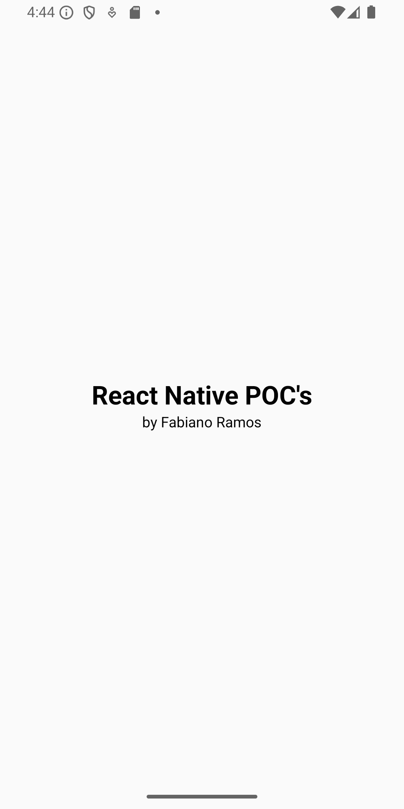

# React Native POC's (Proof of COncepts) - By Fabiano Ramos

  

Desenvolvido em [**React Native**](https://reactnative.dev) usando [`@react-native-community/cli`](https://github.com/react-native-community/cli).

## Branches

| Branch               | Screenshot                                                |
| ----------------- | ---------------------------------------------------------------- |
| main       |  |
| scrollview       |  |
| a definir       |  |
| a definir       |  |

# Saiba mais

Mais sobre React Native:

- [React Native - Site Oficial](https://reactnative.dev) - aprenda mais sobre React Native.
- [Iniciando](https://reactnative.dev/docs/environment-setup) - um **overview** do setup para React Native e como configurá-lo.
- [Aprenda o básico](https://reactnative.dev/docs/getting-started) - Um **tour guiado** pelo React Native **basics**.
- [Blog](https://reactnative.dev/blog) - Leia as últimas da stack em nosso **Blog**.
- [`@facebook/react-native`](https://github.com/facebook/react-native) - Open Source GitHub **repositorio** para o React Native.

## Autor

- [@fabramosdev](https://www.github.com/fabramosdev)

